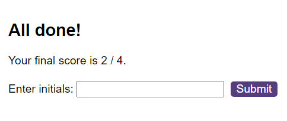
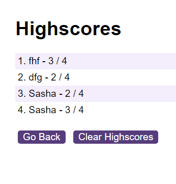

# Code-Quiz
Using learned skills create the code quiz with timer and chance to save the score

## Description
This Project's main goal was to create a quiz. A number of questions should have been included, which were supposed to be answered in 90 sec. The score in the end must have been visible for the user. It was recommended to think through how the user would interact and complete it into a code. For instance, how many questions would there be, how user can choose an answer, how to control the time, will the user be able to input his name and see/save the score. To succeed in this assignment the base was given - two HTML files (the main one and the other one with scores as the must be seen on a different page), CSS file and two JavaScript files were created to cooperate with HTML files.

### Instalation
N/A

### Usage
In this Project all the work was done in logic.js file, which was linked to index.html file. The hs.js file was linked to highscores.html as every html file is supposed to have it's own js file. 
Basically,  the logic.js contains lots of JavaScript code learned in the passed weeks, like getting element from ID, setting timer, forEach function, addEventListener to make an element "alive" by clicking on it, store data in local storage and retreive it. So to start and finish te quiz the user takes the next steps:

- click the button "Start Quiz";

- questions are shown one by one and the time set to 90 sec;

- user chooses answer by clicking on option;

- if the answer is incorrect it subtracts 10 sec from total time;

- the quiz finishes when time ends or questions end;

- after that user can type in his hame and see the score in the "Highscores" tab.

### Credits
N/A

### License
Please refer to the LICENSE in the repo.